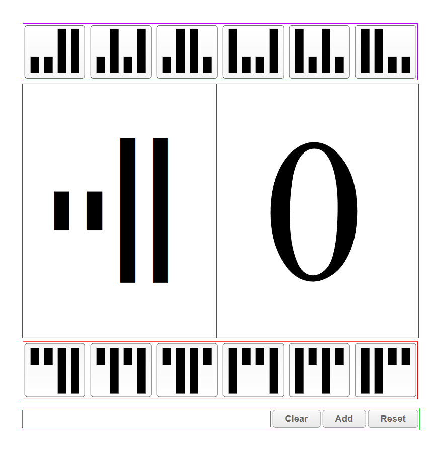
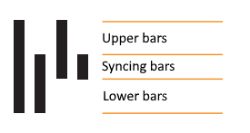
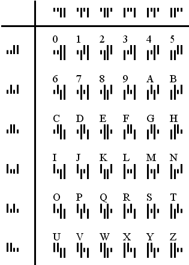

# Manual KIX Decoder

KIX codes are barcodes used by the **Dutch postal service** (**PostNL**) and can be decoded manually without much effort.

This is a small standalone **HTML, CSS, JavaScript** applet that makes decoding these codes even less of a hassle.

## Getting Started

Make use of the live <a href="https://jkctech.github.io/ManualKIX/" target="_blank">Online Demo</a>

##### OR

1. **Download / Clone** this repository
1. Open `index.html` in your favorite browser
1. Have fun decoding!

## How to use

**If you don't know how KIX characters are built-up, please refer below to [How does KIX work?](#how-does-kix-work)**

-  **Upper Half Buttons**
-  **Lower Half Buttons**
-  **Controlset**
	* **Textfield** - Used to memorize characters
	* **Clear** - Clear the textfield
	* **Add** - Adds current built character to the textfield and resets to '0'
	* **Reset** - Reset current character in the window to '0'

## How does KIX work?

KIX codes are basically a **"font"** in which every character is encoded into 4 bars.

Every character can be divided into 3 parts:

By looking at the character as having an "upper" and "lower" half, we can decode characters manually with little effort using the table below.

KIX characters are always in **UPPERCASE** and does not allow any characters outside the charset in the table.

#### KIX Character Table

**Source**: <a href="https://www.postnl.nl/Images/Brochure-KIX-code-van-PostNL_tcm10-10210.pdf">PostNL KIX Manual</a> (In Dutch)
